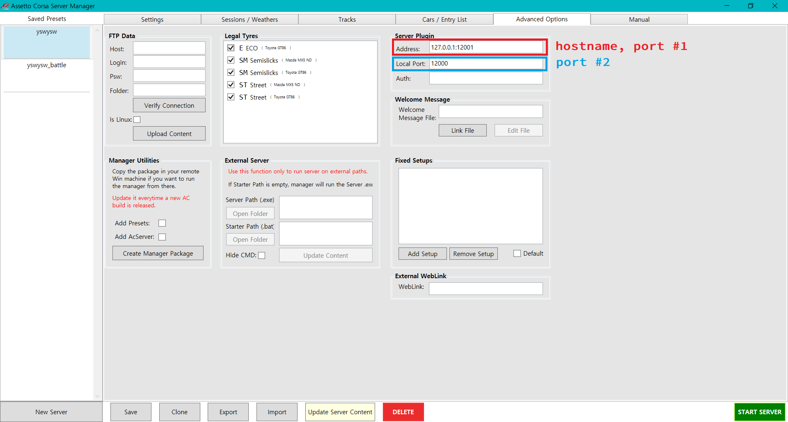

Docs
==============

Index
--------------
* Basic Import
* Basic Functions
* [Event Protocols](https://github.com/sw08/acServer-plugin-js/tree/main/docs/protocols.md)

Basic Import
--------------
```js
const buffer = reuiqre('smart-buffer').SmartBuffer;
const server = require('acserver-plugin');

const app = new server.PluginApp();
```
As this package relies on [smart-buffer](https://github.com/JoshGlazebrook/smart-buffer), you need to use it as well.


Basic functions
--------------



> **new server.PluginApp(config: Object)**

Returns a new instance of `server.PluginApp`.
In `config`, you can set 2 properties.
* `port`: port #1 above. Defaults to `12000`.
* `hostname`: hostname above. Defaults to `127.0.0.1`.

Example:
```js
...

const app = server.PluginApp({port: 12000, hostname: '127.0.0.1'});

...
```

> **app.run(port: Number)**
* `port`: port #2 above. Defaults to `12001`.
  
Starts the plugin app. You'd better run this first and run the server second.

> **app.on(protocol: Number, callback: Function)**
* `protocol`: event protocol. Must be one of [these](https://github.com/sw08/acServer-plugin-js/tree/main/docs/protocols.md).
* `callback`: function to call when the plugin received an event.

Adds listener to the plugin.

Example: 
```js
...

app.on(server.PROTOCOLS.CLIENT_LOADED, (data) => {
    console.log(data);
});

...
```
If protocol you wrote does not exist, it will throw `server.errors.eventNotFound` error.

> **app.sendPacket(packet: buffer.Buffer)**
> 
Sends a raw packet to the server.
Might cause the server to do unexpected things when wrong.

> **app.broadcastChat(text: String)**

Sends a message to everyone in the server.

> **app.sendChat(car_id: Number, text: String)**

Sends a message to specific car in the server.

> **app.kick(car_id: Number)**

Kicks a car in the server.
The picture below will be shown to the kicked user.


> **app.enableRealtimeReport(interval: Number)**

Has the server to get realtime car reports.
The unit of `interval` is `hz`.

> **app.getCarInfo(car_id: Number)**

Sends `server.PROTOCOLS.GET_CAR_INFO` to the server to get a car's information.
After follows `server.PROTOCOLS.CAR_INFO` event.

> **app.getSessionInfo (session_index: Number)**

* `session_index`: The index of session you want to get information of. Defaults to `-1`, which means current session.

Sends `server.PROTOCOLS.GET_SESSION_INFO` to the server to get a session's information.
After follows `server.PROTOCOLS.SESSION_INFO` event.

> **app.setSessionInfo(session_index: Number, name: String, type: Number, laps: Number, time: Number, wait_time: Number)**

* `session_index`: The index of the session to configure.
* `name`: The name of the session.
* `type`: The type of the session. (I have no idea what it is)
* `laps`: The number of laps to end the session.
* `time`: The time to end the session.
* `wait_time`: The time to wait for low rankers.

Configures session information.
Yet doesn't support changing only a portion of the information, so you have to put the entire data to change.

Protocols
--------------
See [here](https://github.com/sw08/acServer-plugin-js/blob/main/docs/protocols.md).